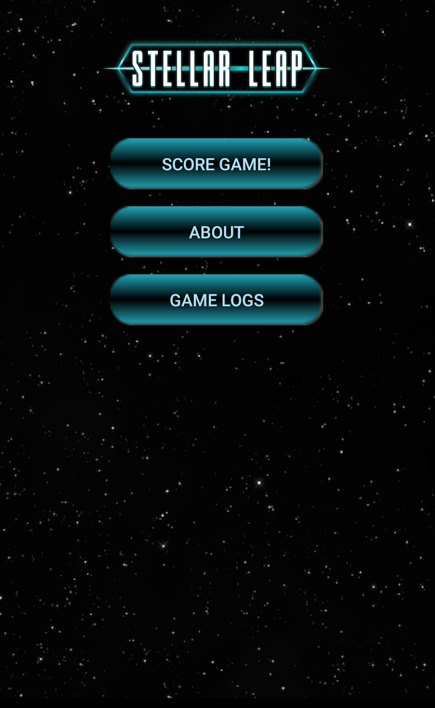
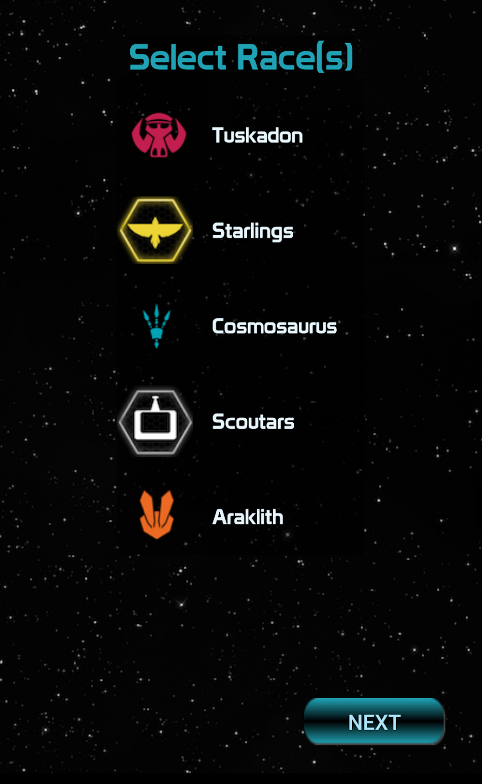
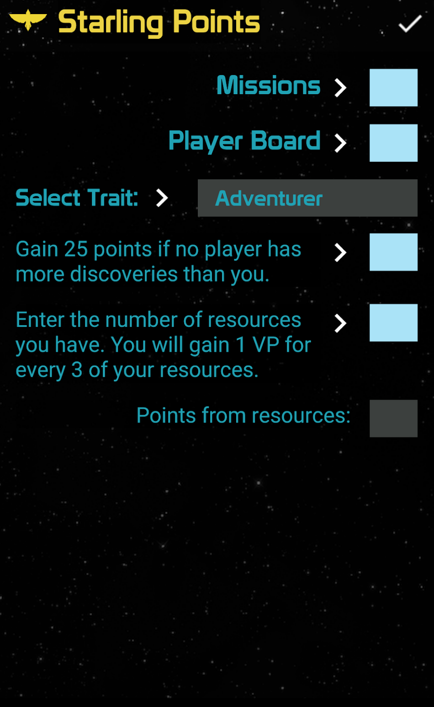
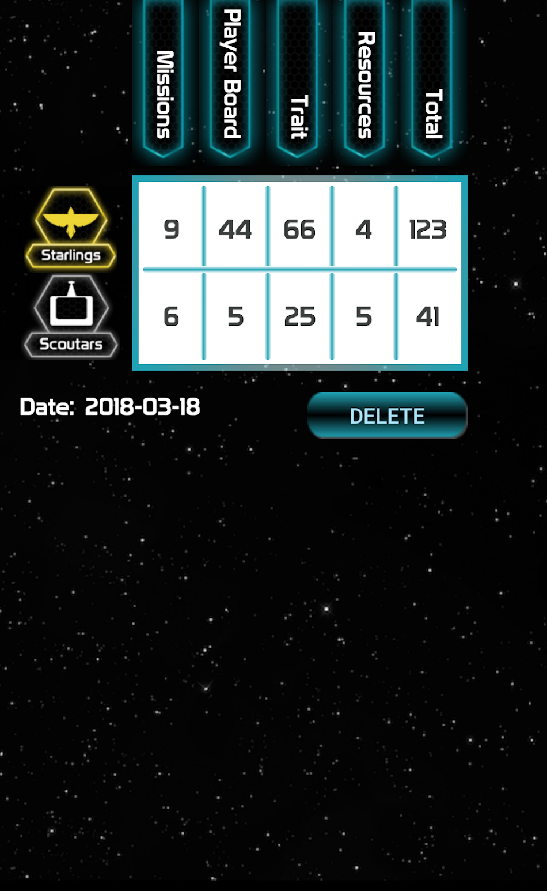
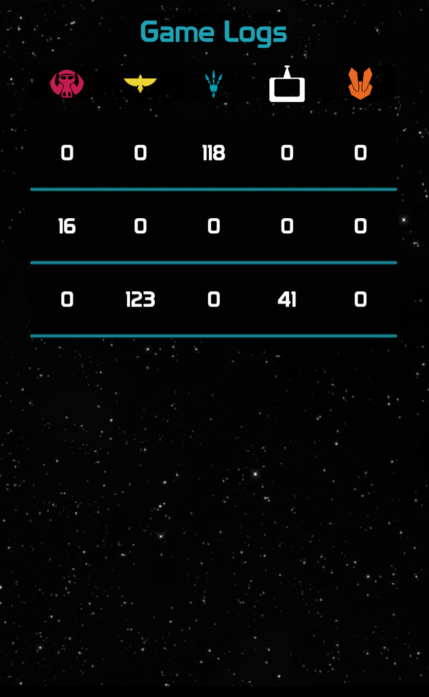

# Stellar Leap Scorepad

This app is intended to support players of the [Stellar Leap](http://weirdgiraffegames.com/stellar-leap.php) board game. 

The app simplifies the end-of-game scoring process. The app also enables the user to save and view a log of past games, to see how your scores have evolved over time.

It is available for download in the [Google Play Store](https://play.google.com/store/apps/details?id=com.weirdgiraffegames.stellarleapscorepad)

# Screenshots

# License

This project code is available under the [MIT LICENSE](https://github.com/fullmers/stellar_leap/blob/master/LICENSE)
